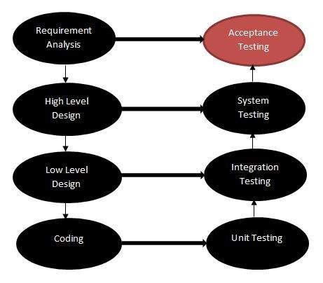

# 验收测试

验收测试，执行测试技术以确定软件系统是否符合要求规范。

此测试的主要目的是评估系统是否符合业务要求，并验证其是否符合向最终用户交付的必要条件。

有各种形式的验收测试：

* 用户验收测试
* 业务验收测试
* Alpha 测试
* Beta 测试

## 验收测试 - 在 SDLC 中

下图说明了验收测试在软件开发生命周期中的适用性。

验收测试用例是根据测试数据或使用验收测试脚本执行的，然后将结果与预期测试结果进行比较。

## 验收标准

验收标准是基于以下属性定义的

* 功能正确性和完整性
* 数据的完整性
* 数据转换
* 可用性
* 性能
* 合时
* 机密性和可用性
* 可安装性和可升级性
* 可扩展性
* 文档

## 验收测试计划 - 属性

验收测试活动分阶段进行。首先，执行基本测试，如果测试结果令人满意，则执行更复杂的场景。

验收测试计划具有以下属性：

* 介绍
* 验收测试类别
* 运营环境
* 测试用例 ID
* 测试题目
* 测试目标
* 测试程序
* 测试时间表
* 资源

验收测试活动旨在得出以下结论之一：

1. 接受系统交付
1. 在请求的修改完成后接受系统
1. 不要接受系统

## 验收测试报告 - 属性

验收测试报告具有以下属性：

* 报告标识符
* 结果摘要
* 变化
* 建议
* 待办事项清单摘要
* 批准决定
