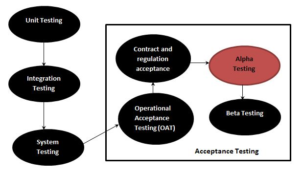

# Alpha 测试

在向外部客户发布之前，内部团队在开发人员的网站上进行 Alpha 测试。在没有开发团队参与的情况下执行此测试。

## Alpha 测试 - 在 SDLC 中

下图说明了 Alpha 测试在软件开发生命周期中的适用性。

## 我们如何运行它

在 alpha 测试的第一阶段，该软件由内部开发人员进行测试，其中的目标是快速捕获错误。

在 alpha 测试的第二阶段，该软件被提供给软件 QA 团队进行额外测试。

在进行 beta 测试之前，Alpha 测试通常作为内部验收测试的一种形式进行商用现成软件（COTS）。
