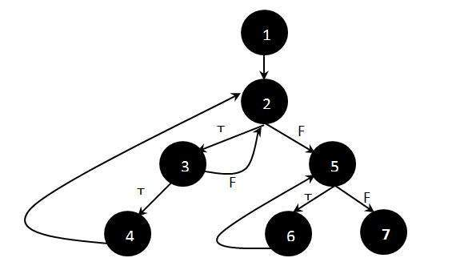

# 基础路径测试

基础路径测试，结构化测试或白盒测试技术，用于设计测试用例，旨在至少检查一次所有可能的执行路径。为所有可能的路径创建和执行测试会产生 100% 的语句覆盖率和 100% 的分支覆盖率。

## 例

```c
Function fn_delete_element (int value, int array_size, int array[])
{
  1 int i;
  location = array_size + 1;

  2 for i = 1 to array_size
  3 if ( array[i] == value )
  4 location = i;
   end if;
   end for;

  5 for i = location to array_size
  6 array[i] = array[i+1];
  end for;
  7 array_size --;
}
```

## 计算独立路径的步骤

1. 绘制正在考虑的功能 / 程序的流程图，如下所示：

    

1. 确定独立路径。

    ```vi
    Path 1:  1 - 2 - 5 - 7
    Path 2:  1 - 2 - 5 - 6 - 7
    Path 3:  1 - 2 - 3 - 2 - 5 - 6 - 7
    Path 4:  1 - 2 - 3 - 4 - 2 - 5 - 6 - 7
    ```
