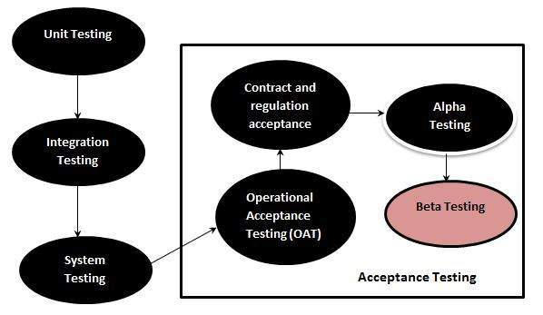

# Beta 测试

Beta 测试也称为用户测试，最终用户在最终用户站点进行测试，以验证可用性，功能，兼容性和可靠性测试。

Beta 测试为软件开发生命周期增加了价值，因为它允许“真正的”客户有机会为产品的设计，功能和可用性提供输入。这些输入不仅对产品的成功至关重要，而且在有效管理收集的数据时对未来产品的投资也是如此。

## Beta 测试 - 在 SDLC 中

下图说明了 Beta 测试在软件开发生命周期中的适用性：

## Beta 测试依赖项

有许多因素取决于 beta 测试的成功与否：

* 测试成本
* 测试参与者数量
* 运输
* 测试持续时间
* 人口统计覆盖率
