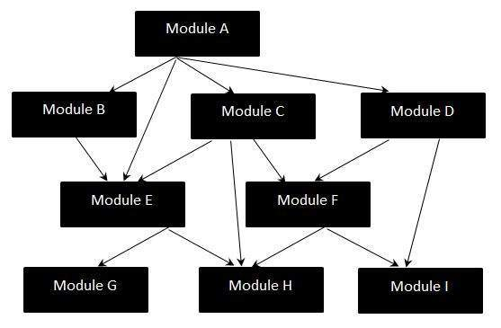

# Big-Bang 测试

Big Bang 集成测试是一种集成测试策略，其中所有单元一次链接，从而形成一个完整的系统。采用这种类型的测试策略时，很难隔离发现的任何错误，因为没有注意验证各个单元之间的接口。

## Big Bang 集成 - WorkFlow 图

Big Bang 测试由以下工作流程图表示：

## Big-Bang 测试的缺点

* 由于所有组件都集成在一个镜头中，因此在组件的接口处出现的缺陷在很晚阶段被识别。
* 隔离发现的缺陷非常困难。
* 很有可能遗漏一些可能在生产环境中出现的关键缺陷。
* 很难涵盖集成测试的所有案例，甚至不会错过任何一个场景。
