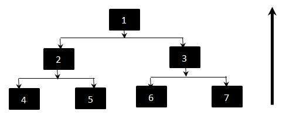

# 自下而上的测试

较低层次的每个组件都单独进行测试，然后测试依赖于这些组件的组件。

## 自下而上的整合

自下而上方法的整合顺序如下：

1. 4,2
1. 5,2
1. 6,3
1. 7,3
1. 2,1
1. 3,1

## 测试方法

* 首先，使用驱动程序分别测试 4、5、6、7。
* 测试 2，使它分别调用 4 和 5。如果出现错误，我们知道问题出在其中一个模块中。
* 测试 1，使它调用 3，如果出现错误，我们知道问题在 3 中，或者在 1 和 3 之间的接口中

尽管顶级组件是最重要的，但最后使用此策略进行了测试。在自下而上的方法中，在测试组件 4,5,6,7 时，组件 2 和 3 被驱动程序替换。它们通常比根开始更复杂。
