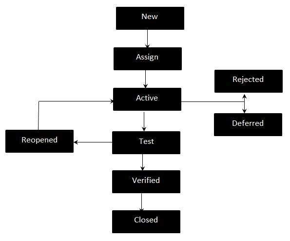

# bug

在软件测试中，当预期和实际行为不匹配时，需要引发事件。事件可能是一个 Bug。程序员打算实现某种行为是程序员的错，但是由于编码中的错误实现，代码无法正确地符合这种行为。它也被称为缺陷。

以下是 Bug 生命周期的工作流程：

## Bug 的参数

以下详细信息应该是 Bug 的一部分：

* 发行日期，作者，批准和状态。
* 事件的严重性和优先级。
* 显示问题的相关测试用例
* 预期和实际结果。
* 识别测试项目和环境。
* 有关重现步骤的事件描述
* 事件的状况
* 结论，建议和批准。
