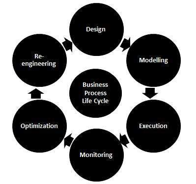

# 业务流程

业务流程是为最终用户生成特定服务或产品的活动或任务的集合。它通常表示为指向 Process Matrix 的一系列活动的流程图。

业务流程建模由流程所有者或产品所有者执行，以使测试团队能够高效地进行测试。它旨在通过优化产品或服务的相关活动的效率来提高业务绩效。

## 业务流程生命周期

业务流程生命周期有以下各个阶段：

## 业务流程测试 BPT

它是一种用于自动和手动测试的工具，用于设计测试，维护测试和执行测试。可重复使用的测试通常由业务分析师设计，以提高测试效率。

## BPT 的好处和特点

* 允许非技术主题专业知识快速构建可重用的测试工作流程。
* 它减少了测试维护所需的工作量。
* 它将手动测试转换为手动测试组件。
* 它提供了一个框架来构建用户验收测试以满足要求。
