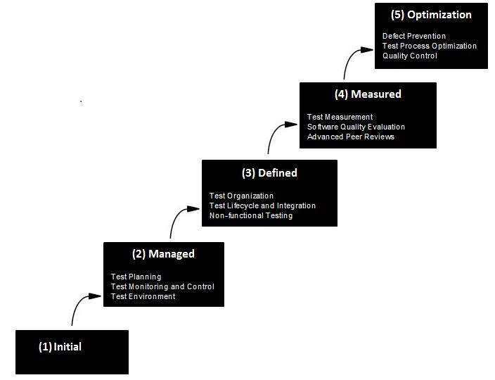

# 能力成熟度模型

软件工程协会（SEI）能力成熟度模型（CMM）规定了一系列不断增加的软件开发组织级别。级别越高，软件开发过程越好，因此达到每个级别是一个昂贵且耗时的过程。

## CMM 级别

* 第一级：初始

  软件过程的特点是不一致，有时甚至是混乱的。在危机期间放弃存在的定义过程和标准实践。组织的成功主要取决于个人的努力，才能和英雄。英雄最终转向其他组织，他们将丰富的知识或经验教训带到他们身边。

* 第二级：可重复

  此级别的软件开发组织具有基本且一致的项目管理流程，可跟踪成本，进度和功能。该流程已经到位，可以重复早期在具有类似应用的项目上取得的成功。项目管理是二级组织的关键特征。

* 第三级：定义

  管理和工程活动的软件过程记录，标准化，并集成到整个组织的标准软件过程中，整个组织的所有项目都使用经过批准的，定制的组织标准软件过程版本进行开发，测试和维护应用程序。

* 第四级：管理

  管理可以使用精确的测量有效地控制软件开发工作。在此级别，组织为软件过程和软件维护设定了定量质量目标。在此成熟度级别，流程的性能使用统计和其他定量技术进行控制，并且在数量上是可预测的。

* 第五级：优化

  该级别的关键特征是通过渐进式和创新性技术改进，不断改进过程性能。在此级别，流程的变化是改善流程绩效，同时保持统计概率，以实现既定的流程改进目标。
