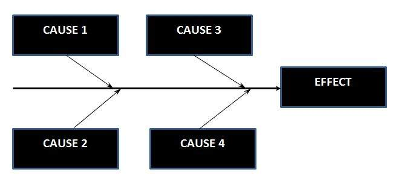

# 因果图

因果图是一种黑盒测试技术，以图形方式说明给定结果与影响结果的所有因素之间的关系。

它也被称为 Ishikawa 图，因为它是由 Kaoru Ishikawa 发明的，因为它的外观也称为鱼骨图。

## 什么情况使用因果图

确定可能的根本原因，特定效果，问题或结果的原因。

将系统之间的相互作用与影响特定过程或效果的因素联系起来。

分析现有问题，以便最早采取纠正措施。

## 好处

* 它帮助我们使用结构化方法确定问题或质量的根本原因。
* 它使用有序，易于阅读的格式来绘制因果关系。
* 它表示过程中可能的变化原因。
* 它标识应收集数据以供进一步研究的区域。
* 它鼓励团队参与并利用团队对流程的了解。
* 它通过帮助每个人更多地了解工作中的因素及其相关性来增加对过程的了解。

## 绘制因果图的步骤

1. 确定并定义效果
1. 填写效果框并画出脊柱
1. 确定导致研究效果的主要原因。
1. 对于每个主要分支，确定可能是 EFFECT 原因的其他特定因素。
1. 对相对原因进行分类并提供详细的原因。
