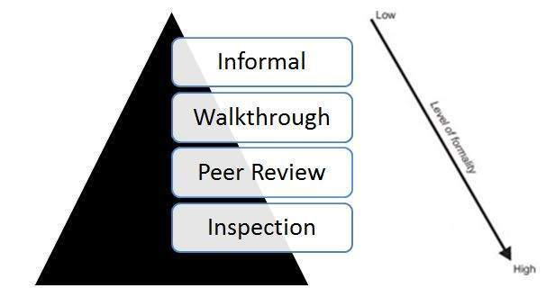

# 无代码测试

无代码测试，在不执行代码的情况下执行的测试技术。静态测试技术（如检查和静态分析）是无代码测试的一部分。

* 审核

  通常用于查找和消除文档中的错误或含糊之处，例如需求，设计，测试用例等。

* 静态分析

  开发人员编写的代码（通常通过工具）分析可能导致缺陷的结构缺陷。

## 评论类型

评论的类型可以通过一个简单的图表给出：

## 静态分析 - 按工具

以下是静态分析期间工具发现的缺陷类型：

* 具有未定义值的变量
* 模块和组件之间的接口不一致
* 声明但从未使用过的变量
* 无法访问的代码（或）死代码
* 编程标准违规
* 安全漏洞
* 语法违规
