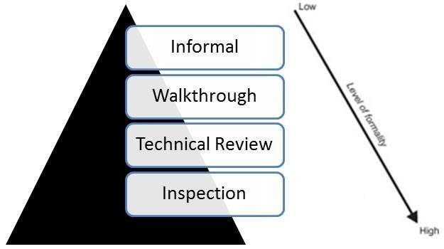

# 代码检查

## 什么是代码检查

代码检查是最正式的审查类型，它是一种静态测试，以避免在后期出现缺陷。

* 代码检查的主要目的是发现缺陷，如果有的话，还可以发现任何流程改进。
* 检查报告列出了调查结果，其中包括可用于帮助改进流程以及纠正所审查文档中的缺陷的指标。
* 会议前的准备工作至关重要，其中包括阅读任何源文件以确保一致性。
* 检查通常由训练有素的主持人领导，主持人不是代码的作者。
* 检查过程是基于规则和检查表的最正式的检查类型，并使用进入和退出标准。
* 它通常涉及代码的同行检查，每个代码都有一组定义的角色。
* 会议结束后，采用正式的后续流程确保及时完成纠正措施。

## 代码检查适合哪些地方

