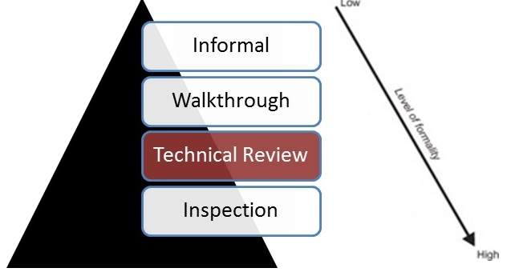

# 代码审查

代码审查是一项系统检查，可以查找和删除代码中的漏洞，如内存泄漏和缓冲区溢出。

* 技术评审已有详细记录，并使用明确定义的缺陷检测流程，其中包括同行和技术专家。
* 理想情况下，由训练有素的主持人领导，他不是作者。
* 这种审查通常在没有管理层参与的情况下作为同行评审进行。
* 审稿人为审查会议做准备，并准备一份审查报告，其中包含调查结果清单。
* 技术评审可能非常非正式或非常正式，可以有许多目的，但不限于讨论，决策，替代方案评估，发现缺陷和解决技术问题。

## Code Review 适合哪些地方

