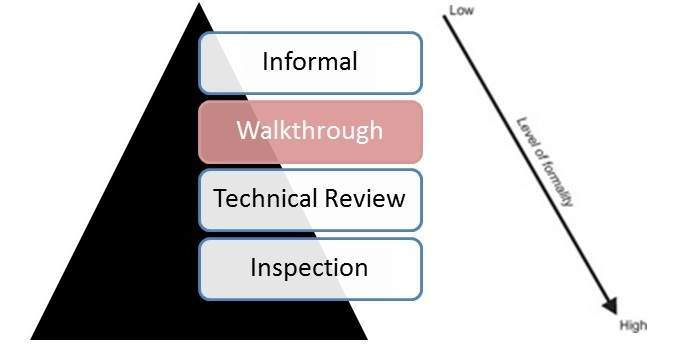

# 代码走查

代码走查是一种同行评审形式，其中程序员领导审核流程，其他团队成员提出问题并根据开发标准和其他问题发现可能的错误。

会议通常由走查文件的作者领导，并由团队的其他成员参加。

走查会议可以是正式的或非正式的。

在走查会议之前，由审阅者准备，然后是走查报告，其中包含调查结果列表。

不是作者的抄写员标记会议记录并记下所有缺陷 / 问题，以便可以追踪到结束。

走查的主要目的是使学习有关正在走查的文档的内容，以帮助团队成员了解文档的内容，并找到缺陷。

## Code Walkthrough 适合哪些地方

