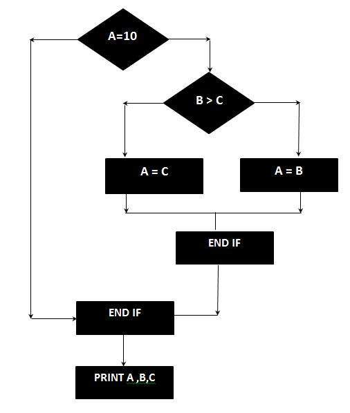

# 圈复杂度

圈复杂度是源代码复杂度测量，其与许多编码错误相关联。它是通过开发代码的控制流程图来计算的，该代码测量通过程序模块的线性无关路径的数量。

降低程序的圈复杂度，降低修改和更容易理解的风险。它可以使用以下公式表示：

```vi
圈复杂度 = E - N + 2*P

E = 流程图中的边数
N = 流程图中的节点数
P = 具有退出点的节点数
```

## 示例

```vi
IF A = 10 THEN
 IF B > C THEN
   A = B
 ELSE
   A = C
 ENDIF
ENDIF
Print A
Print B
Print C
```

## 流图



使用上面的控制流程图计算 Cyclomatic 复杂度，该控制流程图显示七个节点（形状）和八个边缘（线），因此圈复杂度为 `8 - 7 + 2 = 3`
