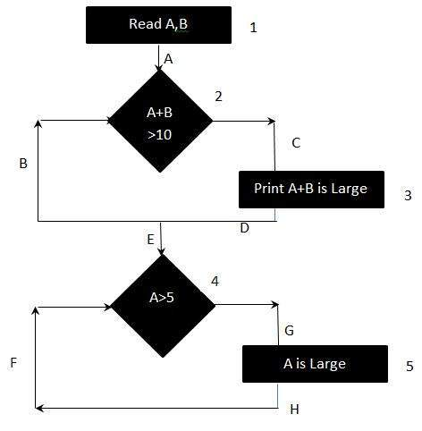

# 决策覆盖测试

决策覆盖或分支覆盖是一种测试方法，旨在确保每个决策点的每个可能分支至少执行一次，从而确保执行所有可到达的代码。

也就是说，每一个决定都采取各自的方式，无论是真是假。它有助于验证代码中的所有分支，确保没有分支导致应用程序的异常行为。

## 例

```c
Read A
Read B
IF A+B > 10 THEN
  Print "A+B is Large"
ENDIF
If A > 5 THEN
  Print "A Large"
ENDIF
```

上述逻辑可以用流程图表示为：



## 覆盖率

要计算分支的覆盖率，必须找出最小路径数，以确保所有的边都被覆盖。在这种情况下，没有一个单一的路径可以确保同时覆盖所有的边。目的是覆盖所有可能的正确 / 错误决策。

1. `1A-2C-3D-E-4G-5H`
1. `1A-2B-E-4F`

因此决策或分支覆盖率为 2。
