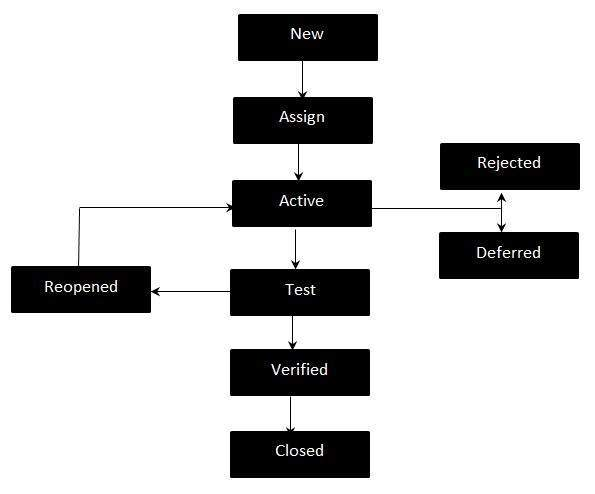

# 缺陷生命周期

缺陷生命周期，也称为 Bug 生命周期，是缺陷循环的过程，缺陷在其生命周期中经历。它因组织和组织而异，因为它受软件测试过程的控制，也取决于所使用的工具。

## 缺陷生命周期 - 工作流程

## 缺陷生命周期

* New

  提出但尚未验证的潜在缺陷。

* Assigned

  已分配给开发团队以解决该问题，但尚未解决。

* Active

  正在解决缺陷，调查正在进行中。

* Test

  缺陷已修复并准备好进行测试。

* Verified

  重新测试的缺陷和测试已通过 QA 验证。

* Closed

  在 QA 重新测试后可以关闭的缺陷的最终状态，或者如果缺陷重复或被视为非缺陷，则可以关闭缺陷的最终状态。

* Reopened

  当缺陷未修复时，QA 重新打开 / 重新激活缺陷。

* Deferred

  当在该特定周期中无法解决缺陷时，将推迟到将来的版本中。

* Rejected

  由于以下 3 个原因中的任何一个，可以拒绝缺陷；

  重复缺陷，不是缺陷，不可重复。
