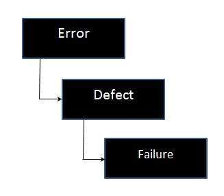

# 失败

在某些情况下，产品可能会产生错误的结果。它被定义为交付服务与遵守规范的偏差。

并非所有缺陷都会导致失败，因为死代码中的缺陷不会导致失败。

## 失败的流程图

## 失败的原因

* 环境条件，可能导致硬件故障或任何环境变量的变化。
* 通过键入错误的输入与软件交互时出现人为错误。
* 如果用户试图执行某些操作而意图破坏系统，则可能会发生故障。

## 失败的结果

* 失去时间
* 损失金钱
* 商业声誉的丧失
* 伤
* 死亡
