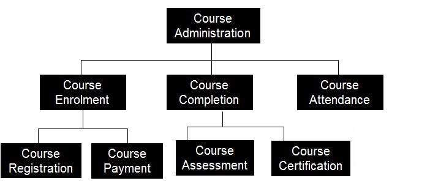

# 功能分解

功能分解对应于如何开发原始复杂业务功能的各种功能关系。它主要关注如何开发整体功能及其在各个组件之间的交互。

当使用功能分解分解成碎片时，更容易理解大的或复杂的功能。

## 何时以及如何

功能分解主要在项目分析阶段使用，以生成功能分解图作为功能需求文档的一部分。

功能分解是在与业务分析师和主题专业知识会面后完成的。

用其功能分解第一级组件，并继续分解到较低级别，直到达到足够的细节水平

执行业务操作的端到端演练，并检查每个功能以确认它是否正确。

