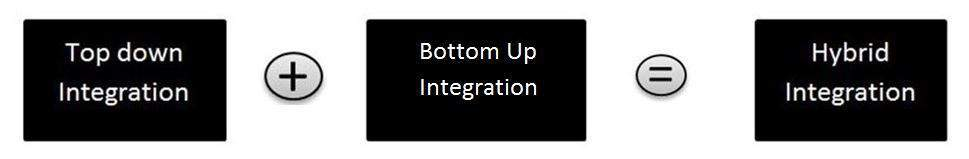

# 混合集成测试

集成测试是软件测试的一个阶段，其中独立模块被组合并作为单个实体进行测试。在该阶段期间，测试这些模块中的每一个之间的接口和通信。集成测试有两种流行的方法，即自上而下的集成测试和自下而上的集成测试。

在混合集成测试中，我们利用自上而下和自下而上的方法的优势。顾名思义，我们使用了两种集成技术。

## 混合集成测试 - 功能

它被视为三层；即 - 主要目标图层，目标图层上方的图层和目标图层下方的图层。

测试主要针对中级目标层，并根据系统特性和代码结构进行选择。

如果客户希望尽快处理应用程序的工作版本，旨在在开发周期的早期阶段生成基本工作系统，则可以采用混合集成测试。
