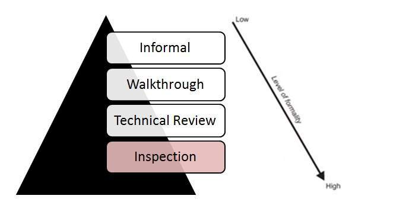

# 检查

检查是最正式的审查形式，是静态测试阶段采用的策略。

## 检查特点

* 检查通常由训练有素的主持人领导，主持人不是作者。主持人的角色是对文档进行同行检查

* 检查是最正式的，由检查表和规则驱动。

* 此审核流程使用进入和退出标准。

* 进行会前准备工作至关重要。

* 准备检查报告并与作者分享以采取适当的行动。

* 检查后，使用正式的后续流程来确保及时和及时的纠正措施。

* 检查的目的不仅是识别缺陷，还要引入过程改进。
