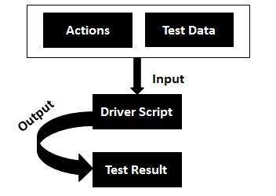

# 关键字驱动测试

关键字驱动测试是一种功能自动化测试框架，也称为表驱动测试或基于动作字的测试。

在关键字驱动的测试中，我们使用表格格式（通常是电子表格）来为我们想要执行的每个函数定义关键字或操作字。

## 好处

* 它最适合新手或非技术测试人员。

* 使用此方法可以以更抽象的方式编写测试。

* 关键字驱动的测试允许在 SDLC 中更早地启动自动化，甚至在为测试提供稳定的构建之前。

* 具有高度的可重用性。

## 缺点

* 开发关键字及其相关功能的初期投资可能需要更长时间。

* 它可能会对技术能力强的测试人员产生限制。
