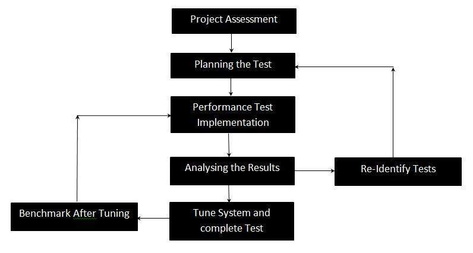

# 性能测试

性能测试，一种非功能性测试技术，用于根据各种工作负载下的响应性和稳定性确定系统参数。性能测试测量系统的质量属性，例如可伸缩性，可靠性和资源使用。

## 性能测试技术

* 负载测试

  这是最简单的测试形式，用于了解特定负载下系统的行为。负载测试将导致测量重要的业务关键事务，并且还监视数据库，应用程序服务器等的负载。

* 压力测试

  执行此操作以查找系统的上限容量，并确定当前负载远高于预期最大值时系统的执行情况。

* 浸泡测试

  浸泡测试也称为耐久性测试，用于确定连续预期负载下的系统参数。在浸泡测试期间，监视诸如内存利用率的参数以检测内存泄漏或其他性能问题。主要目的是发现系统在持续使用下的性能。

* 尖峰测试

  尖峰测试是通过非常大量地增加用户数量并测量系统性能来执行的。主要目的是确定系统是否能够承受工作量。

## 性能测试流程

## 性能测试的属性

* 速度

* 可扩展性

* 稳定性

* 可靠性
