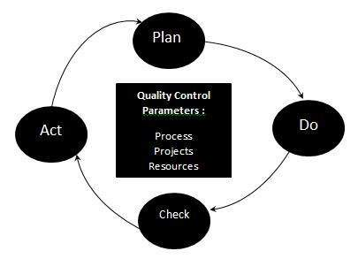

# 质量控制

质量控制是组织用于实现质量参数或质量目标的一套方法，并不断提高组织确保软件产品满足质量目标的能力。

## 质量控制流程

## 控制软件质量的三个类参数是

* 制品

* 流程

* 资源

## 全面质量控制流程包括

* 计划 - 这是计划质量控制流程的阶段

* 执行 - 使用定义的参数来提高质量

* 检查 - 阶段以验证是否满足参数的质量

* 法案 - 如果需要采取纠正措施并重复工作

## 质量控制特点

* 采用流程以最佳成本向客户提供优质产品。

* 目标是向其他组织学习，以便每次都能提高质量。

* 通过正确的审核流程，通过正确的计划和执行来避免错误。
