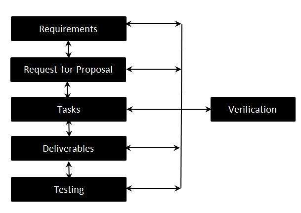

# 需求可追溯性矩阵

需求跟踪，记录需求与为实现和验证这些需求而开发的工作产品之间的链接的过程。RTM 在生命周期结束时提供的单个文档中捕获所有需求及其可跟踪性。

## RTM - WorkFlow

Matrix 是在项目的最初阶段创建的，因为它构成了项目范围和可交付成果的基础。

Matrix 是双向的，因为它通过检查可交付成果的输出来跟踪需求，并通过查看为产品的特定功能指定的业务需求来向后追踪需求。

## 需求可追溯性矩阵 - 参数

* 要求 ID

* 风险

* 要求类型

* 要求说明

* 追溯设计规范

* 单元测试用例

* 集成测试用例

* 系统测试用例

* 用户验收测试用例

* 跟踪测试脚本
