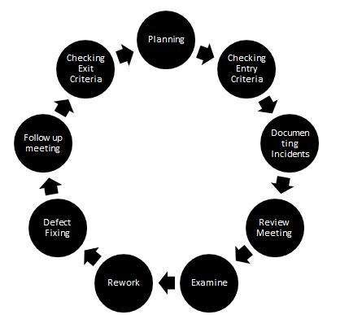

# 审核

审核是由一个或多个人对文档进行系统检查，主要目的是在软件开发生命周期的早期发现并消除错误。评论用于验证文档，例如需求，系统设计，代码，测试计划和测试用例。

通常手动执行评审，同时使用工具执行工具的静态分析。

## 审核流程的重要性

* Dev 团队的生产力得到改善，时间尺度缩短，因为早期阶段和工作产品中缺陷的纠正将有助于确保这些工作产品清晰明确。

* 由于在初始阶段有足够的时间，测试成本和时间会减少。

* 降低成本，因为最终软件中的缺陷更少。

## 审核过程中的缺陷类型

* 与监管或贸易组织内部定义或定义的标准的偏差。

* 要求缺陷。

* 设计缺陷。

* 接口规格不正确。

## 审查阶段 - 工作流程

