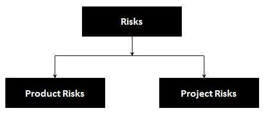

# 风险

风险可以定义为事件，危险，事故，威胁或情况发生的概率及其不良后果。这是一个可能导致负面后果的因素，通常表示为影响和可能性的产物。

## 风险类型

在软件术语中，风险大致分为两大类：

## 项目风险

* 供应商问题

* 组织因素

* 技术问题

## 产品风险

以下是 LIVE 环境中发生的一些产品风险：

* 提供缺陷 Prone 软件

* 产品中可能对个人（伤害或死亡）或公司造成伤害的严重缺陷

* 软件功能差

* 软件功能不一致
