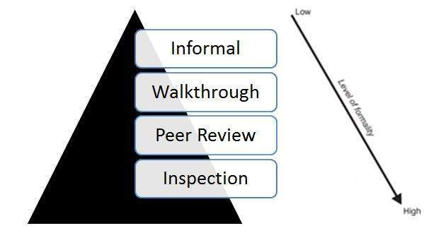

# 静态测试

静态测试，一种软件测试技术，在该技术中测试软件而不执行代码。它有两部分，如下所示：

* 审核 - 通常用于查找和消除文档中的错误或含糊之处，例如需求，设计，测试用例等。

* 静态分析 - 开发人员编写的代码（通常通过工具）分析可能导致缺陷的结构缺陷。

## 类型

评论的类型可以通过一个简单的图表给出：

## 静态分析 - 按工具

以下是静态分析期间工具发现的缺陷类型：

* 具有未定义值的变量

* 模块和组件之间的接口不一致

* 声明但从未使用过的变量

* 无法访问的代码（或）死代码

* 编程标准违规

* 安全漏洞

* 语法违规
