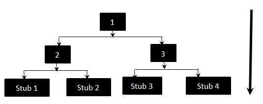

# 存根

在自上而下的集成测试期间使用存根，以模拟尚未集成的较低级别模块的行为。存根是模块，它们作为被调用模块的临时替代，并提供与实际产品相同的输出。

当软件需要与外部系统交互时，也会使用存根。

## 存根 - 流程图



上图清楚地表明模块 1,2 和 3 可用于集成，而下面的模块仍处于开发阶段，此时无法集成。因此，Stubs 用于测试模块。整合的顺序将是：

```vi
1,2
1,3
2,Stub 1
2,Stub 2
3,Stub 3
3,Stub 4
```

## 测试方法

1. 首先，模块 1、2、3 之间的集成
1. 测试模块 2 和存根 1、存根 2 之间的集成
1. 测试模块 3 与存根 3、存根 4 的集成
