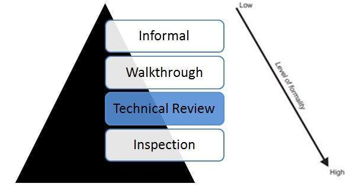

# 技术评论

技术评论是一种静态白盒测试技术，用于在生命周期的早期发现缺陷，这是黑盒测试技术无法检测到的。

## 技术评论 - 静态测试

## 技术评论特点

* 技术评审已记录在案，并使用缺陷检测流程，该流程由同行和技术专家组成，作为审核流程的一部分。

* 审核流程不涉及管理层参与。

* 它通常由训练有素的主持人领导，而主持人不是作者。

* 编写报告时列出了需要解决的问题清单。
