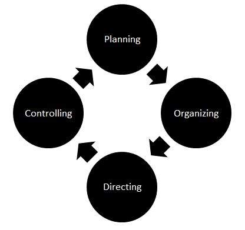

# 全面质量管理

TQM 可以定义为用于改进流程，产品，服务以及与产品相关的其他方法的管理技术。它专注于整个业务，而不仅仅是针对特定项目或流程。

## TQM 的要素

* 根本原因分析

* 以客户为中心

* 积极的员工参与

* 面向过程

* 内部和外部自我评估

* 连续的提高

* 做出明智的决策

* 有效的沟通

## 质量控制工具

* 原因 - 效果图

* 清单

* 直方图

* 图表

* 帕累托图

* 树图

* 箭头图

## 流程改进周期

