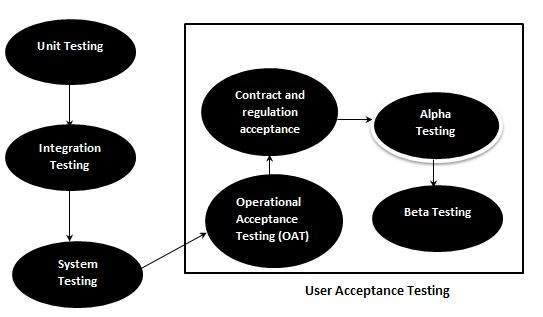

# 用户验收测试

用户验收测试，一种测试方法，其中客户 / 最终用户参与测试产品以根据他们的要求验证产品。它在开发人员站点的客户端位置执行。

对于医药或航空工业等行业，合同和法规符合性测试以及操作验收测试也作为用户验收测试的一部分进行。

UAT 依赖于上下文，UAT 计划是根据要求准备的，并非强制执行各种用户验收测试，甚至由测试团队协调和贡献。

## 用户验收测试 - 在 SDLC 中

下图说明了用户验收测试在软件开发生命周期中的适用性：

验收测试用例是根据测试数据或使用验收测试脚本执行的，然后将结果与预期测试结果进行比较。

## 验收标准

验收标准是根据以下属性定义的：

* 功能正确性和完整性

* 数据的完整性

* 数据转换

* 可用性

* 性能

* 合时

* 机密性和可用性

* 可安装性和可升级性

* 可扩展性

* 文档

## 验收测试计划 - 属性

验收测试活动分阶段进行。首先执行基本测试，如果测试结果令人满意，则执行更复杂的场景。

验收测试计划具有以下属性

* 介绍

* 验收测试类别

* 运营环境

* 测试用例 ID

* 测试题目

* 测试目标

* 测试程序

* 测试时间表

* 资源

验收测试活动旨在得出以下结论之一：

1. 接受系统交付

2. 在请求的修改完成后接受系统

3. 不要接受系统

## 验收测试报告 - 属性

验收测试报告具有以下属性：

* 报告标识符

* 结果摘要

* 变化

* 建议

* 待办事项清单摘要

* 批准决定
