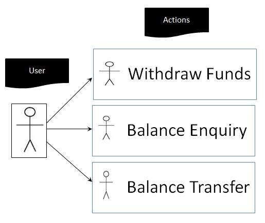

# 用例测试

用例测试是一种功能性黑盒测试技术，可帮助测试人员识别从头到尾在每个事务基础上运行整个系统的测试场景。

## 用例测试的特征

* 用例捕获'actor'和'system'之间的交互。

* “演员”代表每个用户参与的用户及其互动。

* 基于用例的测试用例，称为场景。

* 能够识别系统中的间隙，而这些间隙是通过单独测试单个组件而找不到的。

* 在定义验收测试范围方面非常有效。

