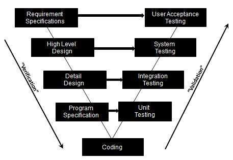

# V 模型

V 模型是一种软件开发生命周期方法，描述了要执行的活动以及在产品生命周期中必须产生的结果。它被称为验证和验证模型验证回答了这个问题 - “我们是否正在开发从该软件中尝试用户所需的所有产品？” 和 Verification 回答了这个问题 - “我们是否通过坚定地遵循所有设计规范来开发此产品？”

## V 模型目标

* 项目风险最小化

* 保证质量

* 整个项目的总成本降低

* 改善所有参与方之间的沟通

## V 模型不同阶段

* 需求阶段，描述收集和分析软件后软件需要执行的操作的文档，以及相应的测试活动是用户验收测试。

* 架构设计阶段是系统测试，其中软件架构被设计并在软件内构建组件并建立组件与相应测试活动之间的关系。

* 高级设计阶段，将系统分解为具有已识别接口的子系统；然后转换为更详细的设计，相应的测试活动是集成测试。

* 详细设计阶段，其中指定了每个组件的详细实现。详细设计分为数据结构，使用的算法和相应的测试活动是单元测试。

* 编码，其中软件的每个组件都经过编码和测试，以验证是否忠实地实现了详细设计。

## V 模型的优点和局限性

好处：

* 强调在产品开发的早期阶段对产品进行验证和验证。

* 每个阶段都是可测试的

* 项目管理可以按里程碑跟踪进度

* 易于理解的实施和使用

限制：

* 不容易同时处理事件。

* 不处理迭代或阶段

* 不容易处理需求的动态变化

* 不包含风险分析或缓解活动
