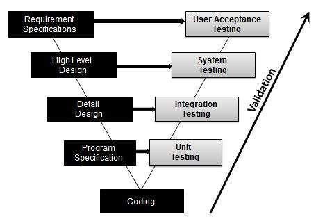

# 验证测试

在开发过程中或在开发过程结束时评估软件以确定其是否满足指定业务要求的过程。

验证测试确保产品真正满足客户的需求。它还可以定义为在适当的环境中部署时证明产品满足其预期用途。

它回答了这个问题，我们正在构建正确的产品吗？

## 验证测试 - 工作流程

使用 V-Model 可以最好地证明验证测试。在此类测试期间评估所测试的软件 / 产品。

## 活动内容

* 单元测试

* 集成测试

* 系统测试

* 用户验收测试
